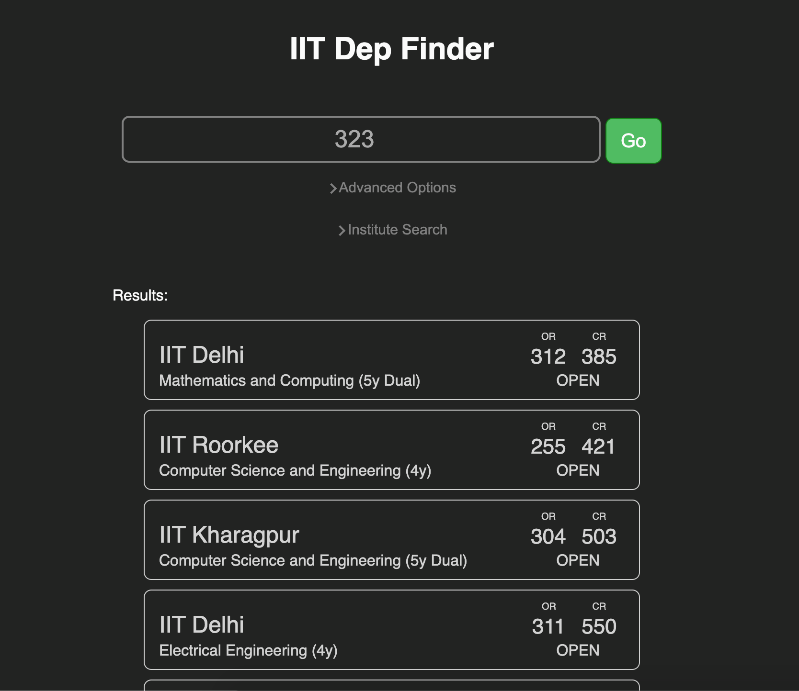

# IIT dep finder



---------------

## Installation:
```
git clone https://github.com/Aniruddha-Deb/IIT_dep_finder.git
cd IIT_dep_finder
```
after this, the preferred way of doing it is to use `venv`:
```
virtualenv venv
echo "venv" > .gitignore
source venv/bin/activate
pip install -r requirements.txt
```

## Usage:
```
flask run
```
This starts the server on localhost:5000. Routing options to be added soon

Data is taken from JoSAA 2020 round 1 seat allocation, and may be inaccurate 
for the lower ranks. There were ~400ish unfilled seats for the lower ranks, which
may contribute to the inaccuracy. 
